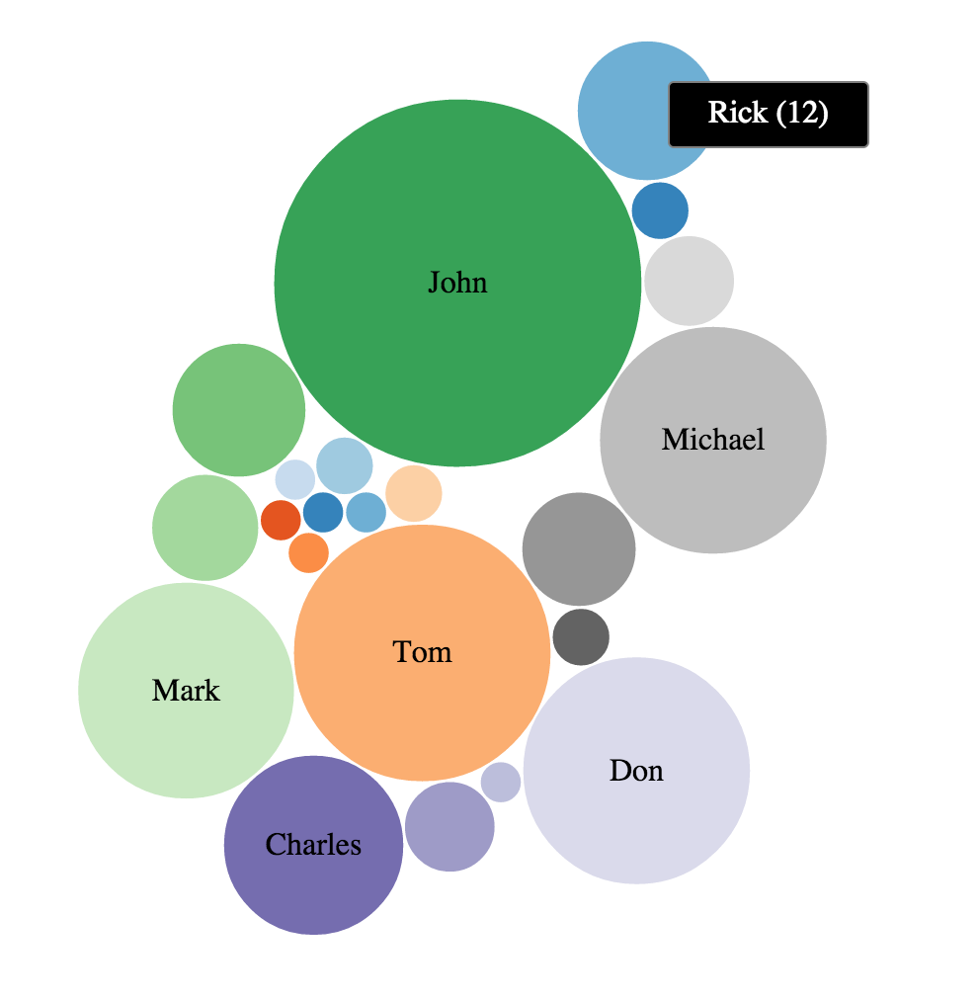
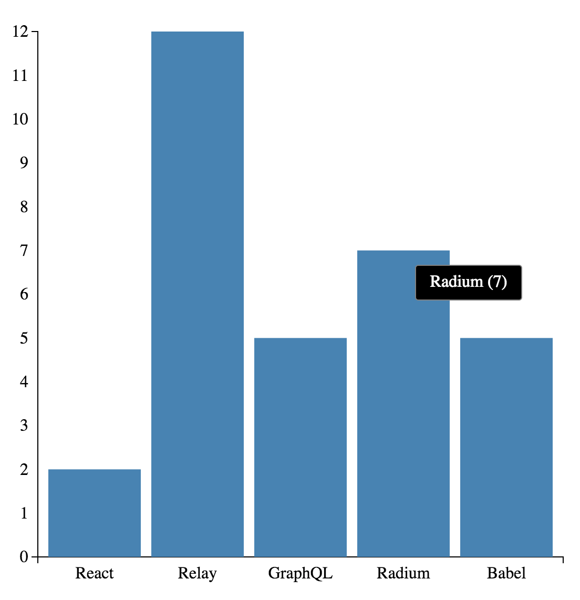

# d3act - d3 with React

## Background

[`d3`](http://d3js.org/) has been the de facto standard when it comes to data visualisations for a while now and [`React`](http://facebook.github.io/react/) has recently emerged as the go-to library for building user interfaces. `d3` and `React` are both data-centric libraries, making them a natural fit; `d3` takes a data-driven approach and `React` aims to solve the problem of data changing over time in the context of building large applications.

In recent months, there have been various approaches documented & implemented in order to showcase how to effectively use `d3` and `React` together, especially with a focus on letting `React` do the SVG rendering:
- ["D3 and React - the future of charting components?" by 10consulting](http://10consulting.com/2014/02/19/d3-plus-reactjs-for-charting/)
- ["ReactJS and D3 Part I: Layouts" by Colin Megill](http://formidablelabs.com/blog/2015/05/21/react-d3-layouts/)
- ["react-d3 by Eric S. Bullington"](https://github.com/esbullington/react-d3)
- ["react-d3-components by Neri Marschik"](https://github.com/codesuki/react-d3-components)

[Nicolas Hery's "Integrating D3.js visualizations in a React app"](http://nicolashery.com/integrating-d3js-visualizations-in-a-react-app/) talks about letting `d3` do all the work after React has finished rendering components in the DOM. `d3act` is inspired by [@nicolas_hery](https://twitter.com/nicolas_hery)'s approach; create a lightweight `React` component wrapper that maps `React`'s lifecycle methods `componentDidMount`, `componentDidUpdate` and `componentWillUnmount` into a `d3` chart's `create`, `update` and `unmount` methods respectively.

`d3act` and the idea behind it was first presented at [ReactEurope 2015](https://www.react-europe.org/2015.html) as a five minute lightning talk; you can watch it [here](https://www.youtube.com/watch?v=6Pbf0n85HH8).

## How does this improve DX?

During the [keynote](https://www.youtube.com/watch?v=PAA9O4E1IM4) at ReactEurope 2015, [vjeux](https://twitter.com/vjeux) introduced the idea of DX (Developer Experience) - akin to UX (User Experience), but with a focus on enabling developers to build great UX with the best possible tools & technologies. Things like [Babel](babeljs.io), [Redux](https://github.com/gaearon/redux) and [Radium](https://github.com/FormidableLabs/radium) definitely tick the DX box.

So how does `d3act` improve DX? The need for creating `d3act` first emerged while building multiple `d3`-based visualisations to handle very large data sets in a single page in the context of a `React` app. Letting `React` manipulate and render `SVG` elements proved to slow things down - not by much, but at the scale of data that was being handled, this became a bottleneck.

At the same time, all existing visualisations were already written in the standard `d3` way which performed best - so in order to improve the DX let's wrap these existing `d3` visualisations in a lightweight `React` component that can extend to any such visualisations.

As a result, `d3act` aims to enable a better DX by enabling:
- Use of existing `d3` visualisations
- Keep creating `d3` visualisations using the same syntax
- Don't worry about taking apart `d3`'s approach and reimplement the same things in `React`
- Integrate seamlessly with `React` applications
- Utilise what each library is best at

## Getting Started

```bash
npm install d3act
```

### Supported visualisations

Currently there is support for creating bar charts and bubble charts; more are coming!

#### Creating a bubble chart

```js
import React from "react";
import Chart from "d3act";

export default class ExampleBubbleChart extends React.Component {

    constructor(props) {
        super(props);

        this.state = {
            data: {
                children: [
                    { name: "Alaa", value: 1 },
                    { name: "Zaid", value: 1 },
                    { name: "Kareem", value: 2 },
                    { name: "Mahmoud", value: 1 },
                    { name: "Tariq", value: 1 },
                    { name: "Shareef", value: 1 },
                    { name: "Tom", value: 41 },
                    { name: "Forest", value: 2 },
                    { name: "John", value: 84 },
                    { name: "Alex", value: 11 },
                    { name: "Donald", value: 7 },
                    { name: "Mark", value: 29 },
                    { name: "Charles", value: 20 },
                    { name: "Quincy", value: 5 },
                    { name: "Alvan", value: 1 },
                    { name: "Don", value: 32 },
                    { name: "Hassan", value: 2 },
                    { name: "Jordan", value: 8 },
                    { name: "Michael", value: 32 },
                    { name: "Steven", value: 5 },
                    { name: "Rafael", value: 2 },
                    { name: "Rick", value: 12 },
                ]
            }
        }
    }

    render () {
        return (
            <div className="main">
                <Chart
                    type={"bubble"}
                    diameter={500}
                    showTooltips={true}
                    data={this.state.data}
                />
            </div>
        );
    }
}

React.render(React.createElement(ExampleBubbleChart), document.getElementById('content'));
```



#### Creating a bar chart

```js
import React from "react";
import Chart from "d3act";

export default class ExampleBubbleChart extends React.Component {

    constructor(props) {
        super(props);

        this.state = {
            data: [
                { xValue: "React", yValue: 2 },
                { xValue: "Relay", yValue: 12 },
                { xValue: "GraphQL", yValue: 5 },
                { xValue: "Radium", yValue: 7 },
                { xValue: "Babel", yValue: 5 },
            ]
        }
    }

    render () {
        return (
            <div className="main">
                <Chart
                    type={"bar"}
                    width={500}
                    height={500}
                    margin={{ top: 40, right: 40, bottom: 40, left: 40 }}
                    showTooltips={true}
                    data={this.state.data}
                />
            </div>
        );
    }
}

React.render(React.createElement(ExampleBubbleChart), document.getElementById('content'));
```



## What's next?

- Improve API so that you can customise charts beyond just dimensions and margins
- Add an examples folder
- Better error handling
- Manage state better
- Improve tooltips & make them more extensible
- Make it possible to specify your own chart `d3` chart to use with `d3act`
- Think about making expected data for each visualisation a little more uniform
- Add [`eslint`](http://eslint.org/) to ensure code consistency
- Add tests

## Is this the best way to combine `d3` and `React`?

This is one way of combining `d3` with `React`; there are plenty of other ways as already outlined - pick what works best for you. I don't think there is such a thing as a global 'best way' of combining `d3` with `React`, it very much comes down to what you want to do with it.

## Contributing

All contributions are welcome; fork the repository, make your changes and open a pull request. Try to stick to the coding conventions that are already in place.

## License

[MIT](LICENSE)
