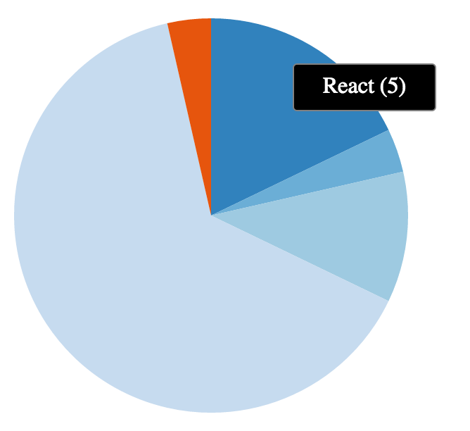

# d3act - d3 with React

## Background

[`d3`](http://d3js.org/) has been the de facto standard when it comes to data visualisations for a while now and [`React`](http://facebook.github.io/react/) has recently emerged as the go-to library for building user interfaces. `d3` and `React` are both data-centric libraries, making them a natural fit; `d3` takes a data-driven approach and `React` aims to solve the problem of data changing over time in the context of building large applications.

In recent months, there have been various approaches documented & implemented in order to showcase how to effectively use `d3` and `React` together, especially with a focus on letting `React` do the SVG rendering:
- ["D3 and React - the future of charting components?" by 10consulting](http://10consulting.com/2014/02/19/d3-plus-reactjs-for-charting/)
- ["ReactJS and D3 Part I: Layouts" by Colin Megill](http://formidablelabs.com/blog/2015/05/21/react-d3-layouts/)
- ["react-d3 by Eric S. Bullington"](https://github.com/esbullington/react-d3)
- ["react-d3-components by Neri Marschik"](https://github.com/codesuki/react-d3-components)

[Nicolas Hery's "Integrating D3.js visualizations in a React app"](http://nicolashery.com/integrating-d3js-visualizations-in-a-react-app/) talks about letting `d3` do all the work after React has finished rendering components in the DOM. `d3act` is inspired by [@nicolas_hery](https://twitter.com/nicolas_hery)'s approach; create a lightweight `React` component wrapper that maps `React`'s lifecycle methods `componentDidMount`, `componentDidUpdate` and `componentWillUnmount` into a `d3` chart's `create`, `update` and `unmount` methods respectively.

`d3act` and the idea behind it was first presented at [ReactEurope 2015](https://www.react-europe.org/2015.html) as a five minute lightning talk; you can watch it [here](https://www.youtube.com/watch?v=6Pbf0n85HH8).

## How does this improve DX?

During the [keynote](https://www.youtube.com/watch?v=PAA9O4E1IM4) at ReactEurope 2015, [vjeux](https://twitter.com/vjeux) introduced the idea of DX (Developer Experience) - akin to UX (User Experience), but with a focus on enabling developers to build great UX with the best possible tools & technologies. Things like [Babel](babeljs.io), [Redux](https://github.com/gaearon/redux) and [Radium](https://github.com/FormidableLabs/radium) definitely tick the DX box.

So how does `d3act` improve DX? The need for creating `d3act` first emerged while building multiple `d3`-based visualisations to handle very large data sets in a single page in the context of a `React` app. Letting `React` manipulate and render `SVG` elements proved to slow things down - not by much, but at the scale of data that was being handled, this became a bottleneck.

At the same time, all existing visualisations were already written in the standard `d3` way which performed best - so in order to improve the DX let's wrap these existing `d3` visualisations in a lightweight `React` component that can extend to any such visualisations.

As a result, `d3act` aims to enable a better DX by enabling:
- Use of existing `d3` visualisations
- Keep creating `d3` visualisations using the same syntax
- Don't worry about taking apart `d3`'s approach and reimplement the same things in `React`
- Integrate seamlessly with `React` applications
- Utilise what each library is best at

## Getting Started

```bash
npm install d3act
```

### Examples

#### It's as simple as...

```js
<Chart
    type={"pie"}
    width={300}
    height={300}
    showTooltips={true}
    data={
        {
            "React": 2,
            "Relay": 12,
            "GraphQL": 5,
        }
    }
/>
```

#### ...and you can use already existing charts

Ensure your existing charts have `constructor`, `create`, `update` and `unmount` functions.

```js
class PreExistingChart {
    constructor(el, props) {
        this.el = el;
        this.props = props;
    }

    create(data) {
        // Create your chart
    }

    update(data) {
        // Update your chart
    }

    unmount() {
        this.el.remove();
    }
}

<Chart
    type={"custom"}
    customChart={PreExistingChart}
    data={
        {
            "React": 2,
            "Relay": 12,
            "GraphQL": 5,
        }
    }
/>
```

To see examples in action locally:

```bash
npm install
npm run examples
```

Head to http://localhost:8080/ and see charts in action as below:




### How do I update charts?

Just update your `data` state and all else is handled for you.

## What's next?

- Improve API so that you can customise charts beyond just dimensions and margins
- Better error handling
- Manage state better
- Improve tooltips & make them more extensible
- Think about making expected data for each visualisation a little more uniform
- Add tests

## Is this the best way to combine `d3` and `React`?

This is one way of combining `d3` with `React`; there are plenty of other ways as already outlined - pick what works best for you. I don't think there is such a thing as a global 'best way' of combining `d3` with `React`, it very much comes down to what you want to do with it.

## Contributing

All contributions are welcome; fork the repository, make your changes and open a pull request. Try to stick to the coding conventions that are already in place.

To build things locally, you can just `grunt watch` from the project's root directory. This will also lint code using [ESLint](http://eslint.org/); if you would like to just lint the code, you could also just use `grunt lint`.

## License

[MIT](LICENSE)
